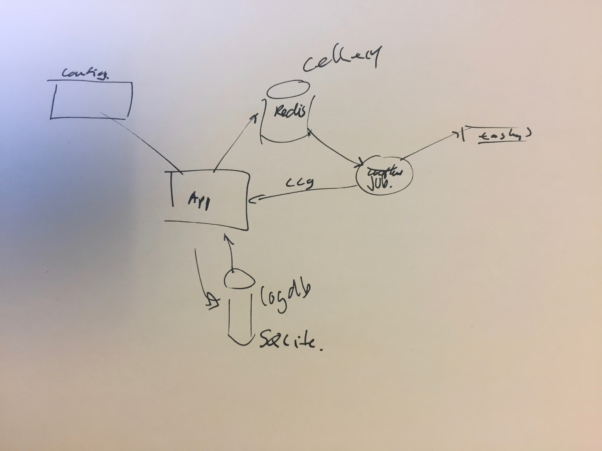

# Technology Stack

   * [Flask](http://flask.pocoo.org/) - for serving web pages
   * [Bootstrap](https://github.com/mbr/flask-bootstrap) - to make pretty (and ease the html building)
   * [SocketIO](https://flask-socketio.readthedocs.io/en/latest/) - to follow events live
   * [Celery](http://flask.pocoo.org/docs/0.12/patterns/celery/) - to handle the jobs
     * [Redis](http://docs.celeryproject.org/en/latest/getting-started/brokers/redis.html#broker-redis) - to handle job queues
     * [SQLite3](https://docs.python.org/3/library/sqlite3.html) - to store task progress   

## General design

The web frontend will offer a form to gather the parameters needed and handle sub components of a task and schedule the 
job for execution. 

A task description is added to a queue and a worker will take care of later.

One form per task type will be offered and the web frontend can potentially start a range of different tasks.

A set of workers will be polling the queue and pick up tasks as they arrive. The workers will report back to the web frontend on the progress of a task. 

The web frontend will store the progress data in SQLite, allowing for the web frontend to offer information about the progress of each ongoing or completed task.

The tasks can be sub calls to other web services that constitute a complete job. i.e. a task can be a sequence of things that have to be done in order or in parallel.

